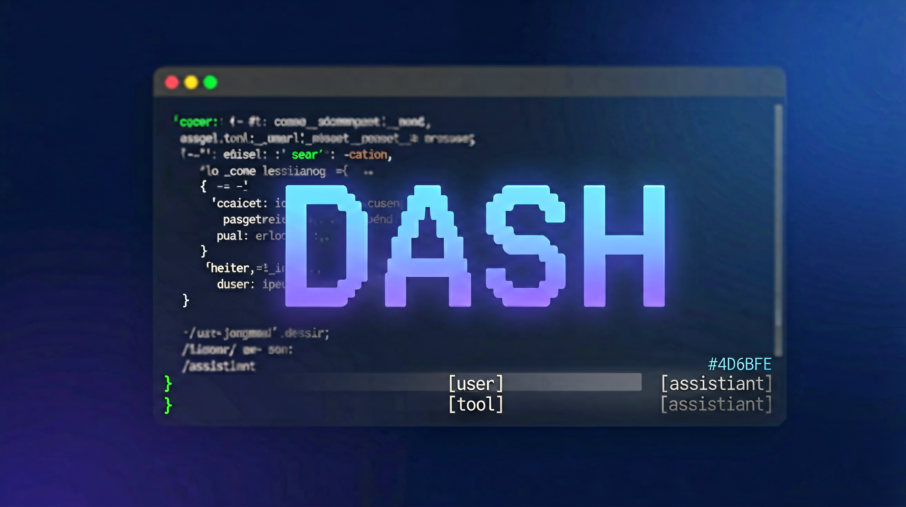

# DASH — DeepSeek Awesome Harness

[](https://github.com/topics/dsh-plugin)
[](https://github.com/realchenwenqiao/dash/stargazers)
[](LICENSE)



**DASH** is a terminal-native front door for [DeepSeek Harness](https://github.com/deepseek-ai/deepseek-harness): the same **everything-is-a-plugin** agent core and multi-provider model switching — inside your shell.

`dash` is a Cordis plugin (bundle) mounted over the official `dsh-base` layer, installed with a single `dsh plugin add`. **DASH** = **D**eepSeek **A**we**S**ome **H**arness.

> 中文版见 [README.md](README.md)。

## Why the terminal?

- One keystroke from your prompt to a coding agent.
- **Multi-model** in one session — `/model` switches providers without leaving the TUI.
- Scriptable, pipe-friendly, and it works over SSH.

## Features

- **Full-screen TUI** with an ANSI-Shadow DASH logo, scrollback (banner, hint, transcript, and editor all scroll as one stream), and a live footer (`cwd (branch)` + cumulative tokens + session id).
- **Multi-line editor** with history, undo, and kill-ring — `Enter` sends, `Shift+Enter` inserts a newline.
- **Markdown rendering** for assistant replies: code blocks, lists, inline code, tables.
- **Collapsible thinking** — reasoning is hidden by default; `Ctrl+O` expands it into a dim block.
- **Collapsible tool output** — each tool result folds to a one-line `↳ N lines` summary; `Ctrl+T` expands it into a code block. Errors stay inline.
- **Slash commands** with a search-box menu and accent highlighting.
- **Multi-model** via `/model` (a picker over the shared llm catalog).
- **API keys** via `/login` (stores through the credential seam and activates the provider route).
- **Tool cards** with argument summaries; output is collapsed until expanded.
- **Session resume** — `/resume` opens a picker (in the input area) over saved sessions; `dash tui --resume <id>` restores one directly.
- **Rewind (time-travel fork)** — double-`Esc` opens a **behavior ledger** in the input area: one row per user message, tool call, and assistant reply, each tagged `[user]`/`[tool]`/`[assistant]` with its turn number and measured duration. Selecting a row forks back to that turn's boundary — a non-destructive branch, not an undo stack.
- **Token / cache-hit / context footer** with cumulative counters.

## What we inherited from dsh

`dash` reuses the entire `dsh-base` plugin tree — nothing agent-related is reimplemented:

- **Everything-is-a-plugin core** — the Cordis runtime, agent loop, tool registry, and session log are all upstream.
- **Multi-provider llm** — `/model` switches over the shared `ctx.llm` catalog.
- **Skill system** — `skill-filesystem` scans `~/.agents/skills` and `<project>/.agents/skills`, so skills shared with Claude Code / Codex / Grok are available to dash's model through the `skill` tool.
- **Tools** — bash, fs, web, subagent, todo, and the rest register through `ctx.tools` unchanged.
- **Session persistence & resume** — `--resume <id>` and `/resume` restore a persisted session.
- **Plan mode, commands, credentials, settings** — the host seams and their handlers.

## Our take

What dash adds is not new capability but a new surface — and a few ideas the terminal can express better than a browser:

- **The terminal is the assembly language of agents.** dsh's "everything is a plugin" is the Unix philosophy applied to agents; dash tries to make composing an agent feel like composing a shell environment.
- **Rewind is a fork, not an undo stack.** Double-`Esc` opens a behavior ledger — one row per user message, tool call, and assistant reply. Selecting a row forks back to that turn's boundary, keeping the old branch (fork lineage preserved) instead of destroying it. Only an append-only behavior log can express this; chat-only harnesses can only rewind messages.
- **A behavior ledger, not a message list.** Mirrors the web Trajectory view: `[user]` / `[tool]` / `[assistant]` rows with turn number and measured duration, so plugin/tool activity is visible.
- **The input rides the content stream.** No docked input box — the editor scrolls away with history, Claude Code-style.
- **One color family.** Everything brand-adjacent sits on the DeepSeek indigo→azure gradient (`#4D6BFE → #3982FF → #2498FF`).

## Install

dash installs as a dsh bundle plugin on top of the official dsh CLI:

```sh
# 1. Install the official dsh CLI (skip if already installed)
npm install -g @deepseek-ai/dsh

# 2. Add the dash plugin to the tui profile (`dsh plugin add` recognizes the
#    `dsh.bundle.patch` declaration and joins it to the bundle layer)
dsh plugin --profile tui add @realchenwenqiao/dash

# 3. Launch
dsh --profile tui
```

> Before the npm publish, run from source:
>
> ```sh
> git clone https://github.com/realchenwenqiao/dash.git
> cd dash
> pnpm install
> pnpm run build
> pnpm dash tui
> ```

Requires Node.js and pnpm. Resume a previous session with `dash tui --resume <session-id>` (the id is printed on exit), or from inside the TUI with `/resume`.

## Usage

Type a prompt and press Enter. The session streams the reply and any tool activity, with a footer showing cumulative `↑ in ↓ out R reasoning`, cache-hit rate, context-window usage, and the current session id (for `--resume`).

### Slash commands

| Command | What it does |
|---------|--------------|
| `/model` | Switch the active model — a picker over every provider the llm registry advertises. |
| `/login` | Add an API key for a provider, activating its route. |
| `/logout` | Clear the stored credential for the active provider. |
| `/resume` | Pick a saved session and resume it in its own workspace. |
| `/new` | Start a brand-new session. |
| `/clear` | Clear the transcript. |
| `/export` | Export the conversation log to a markdown file. |
| `/status` | Show session status (session / cwd / model / plan / tokens / ledger rows). |
| `/cost` · `/tokens` | Show token usage and cache hits. |
| `/thinking` | Toggle extended-thinking display. |
| `/help` | Show shortcuts and the command list. |
| `/audit` `/bug` `/review` `/practice` `/pr_comments` `/release-notes` `/vuln-check` | Skill commands — send an activation prompt to the model (matching SKILL.md files ship with the package). |
| `/exit` · `/quit` | Quit. |
| `/compact` `/plan` `/goal` `/feedback` `/permission` | Host commands, shared with the web UI. |

### Keys

| Key | Action |
|-----|--------|
| `Enter` | Send |
| `Shift+Enter` / `Ctrl+J` | Newline |
| `↑` / `↓` | Input history |
| `Ctrl+O` | Expand / collapse thinking |
| `Ctrl+T` | Expand / collapse tool output |
| `Shift+Tab` | Toggle plan mode |
| `Esc` `Esc` | Open the rewind ledger (fork back to a previous turn) |
| `Ctrl+C` | Cancel an open menu; quit when nothing is open |

## Color card

One indigo→azure brand family, a neutral pair, and three conventional status colors:

| Role | Where it appears |
|------|------------------|
| logo · brand · accent · code | DASH logo, headings, slash commands, selections, inline code |
| dim | tool bodies, footers, reasoning |
| `bgQuote` | user-message blocks (dark indigo fill) |
| success · warning · error | diff added · pending · diff removed |

## Ecosystem

`dash` is a member of the [DeepSeek Harness plugin ecosystem](https://github.com/topics/dsh-plugin) — browse every community plugin under the `dsh-plugin` topic, or the curated [awesome-dsh-plugin](https://github.com/awesome-dsh-plugin/awesome-dsh-plugin) list.

## Architecture

`dash` is a Cordis bundle — `@realchenwenqiao/dash` — mounted over `dsh-base` through the `tui` profile, the same pattern as the `web` and `headless` bundles. The TUI drives the stable surface (`agents.create` / `agent.followup` / `agent.whenIdle` / `session/event`) and renders through [pi-tui](https://github.com/earendil-works/pi-tui) components. Everything upstream stays intact; the TUI is one more surface.

## Development

Start with [docs/development.md](docs/development.md) and [AGENTS.md](AGENTS.md).

## License

[MIT](LICENSE). Third-party notices: [THIRD_PARTY_NOTICES.md](THIRD_PARTY_NOTICES.md).
